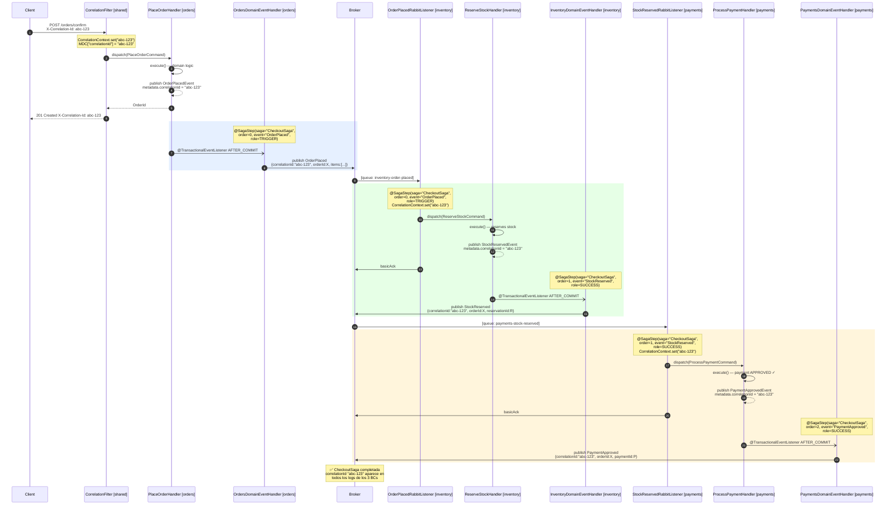
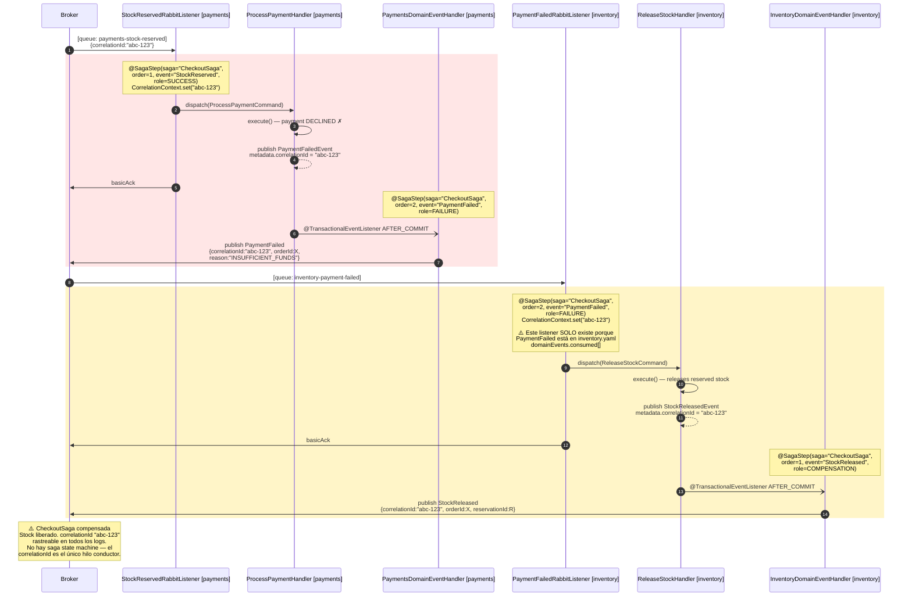

# Referencia: Patrón Saga en dsl-springboot-generator

## Tabla de contenidos

1. [Problema que resuelve](#1-problema-que-resuelve)
2. [Estilo soportado: solo coreografía](#2-estilo-soportado-solo-coreografía)
3. [Dónde se declara](#3-dónde-se-declara)
4. [Schema YAML completo](#4-schema-yaml-completo)
5. [Archivos Java generados](#5-archivos-java-generados)
6. [Inyección de anotaciones en la capa de mensajería](#6-inyección-de-anotaciones-en-la-capa-de-mensajería)
7. [Flujo interno del generador](#7-flujo-interno-del-generador)
8. [Ejemplo completo documentado](#8-ejemplo-completo-documentado)
9. [Comportamiento cuando no hay sagas](#9-comportamiento-cuando-no-hay-sagas)
10. [Limitaciones conocidas](#10-limitaciones-conocidas)
11. [Diagrama de secuencia: flujo completo de CheckoutSaga](#11-diagrama-de-secuencia-flujo-completo-de-checkoutsaga)

---

## 1. Problema que resuelve

### El problema: correlación perdida en procesos cross-BC

Un proceso de negocio que cruza tres o más Bounded Contexts (por ejemplo, checkout → reserva de
stock → confirmación de pago → despacho) genera una cadena de eventos asíncronos. Sin asistencia
del generador:

- El `correlationId` del evento inicial no se propaga entre saltos: cada BC receptor crea un
  nuevo thread sin saber a qué proceso lógico pertenece.
- No existe un identificador estable que permita relacionar en logs/tracing todos los pasos del
  mismo flujo.
- Los handlers de mensajería no expresan su rol dentro del proceso (¿quién dispara la saga?
  ¿quién la cierra? ¿quién compensa?).

### Lo que el generador produce

El generador **no implementa un orquestador ni un motor de saga**. Lo que produce es:

1. **Infraestructura de correlación** — un `ThreadLocal` + MDC (`CorrelationContext`) que propaga
   el `correlationId` desde el evento entrante hasta cualquier evento que el mismo thread
   publique a continuación.
2. **Un filtro HTTP** (`CorrelationFilter`) que establece el `correlationId` en el contexto
   para peticiones entrantes vía REST.
3. **Un descriptor de constantes** por saga (`{SagaName}Steps.java`) — una clase final con
   `public static final String` para el nombre de la saga, el evento trigger y los eventos de
   cada paso. Sin lógica, sin listeners, solo constantes reutilizables.
4. **Anotaciones `@SagaStep`** inyectadas en los handlers de mensajería existentes (listeners y
   `DomainEventHandler`) cuando el evento que manejan participa en algún paso de saga.

La lógica de negocio de cada paso sigue viviendo en los use case handlers, tal como se
generarían sin sagas. La saga es solo una capa de documentación y observabilidad sobre la
coordinación ya existente vía eventos.

---

## 2. Estilo soportado: solo coreografía

El generador soporta **únicamente sagas coreografiadas** (`style: choreography`). No existe
soporte para sagas orquestadas (con un coordinador central). Si se necesita orquestación,
el generador no puede ayudar en esa fase.

En una saga coreografiada:
- No hay un orquestador central.
- Cada BC reacciona a un evento, ejecuta su paso y publica un nuevo evento.
- El `correlationId` es la única clave que relaciona todos los pasos.

---

## 3. Dónde se declara

Las sagas se declaran en `arch/system/system.yaml`, a nivel de sistema, **no** en los YAML
tácticos de cada BC.

```
arch/
└── system/
    └── system.yaml     ← aquí va la sección `sagas:`
```

Ningún archivo `{bc-name}.yaml` declara sagas. Los BCs participantes están implícitos en
los campos `trigger.bc` y `steps[].bc`.

> **Principio de agnosticismo tecnológico:** `system.yaml` es un artefacto de diseño. La
> sección `sagas` describe el proceso de negocio, no la tecnología de coordinación. El
> generador decide cómo implementarlo (ThreadLocal + MDC + anotaciones).

---

## 4. Schema YAML completo

### Estructura raíz

```yaml
# arch/system/system.yaml
sagas:
  - name: OrderFulfillmentSaga          # PascalCase — nombre de clase Java
    description: >                      # opcional — va al Javadoc de {SagaName}Steps.java
      Coordina el flujo de fulfillment completo desde la
      confirmación de pago hasta el despacho físico.
    trigger:                            # requerido — evento que inicia la saga
      event: PaymentConfirmed           # PascalCase — nombre del domainEvent
      bc: payments                      # kebab-case — BC que publica el evento trigger
    steps:                              # requerido — lista de pasos en orden de ejecución
      - order: 1                        # integer, opcional (default: 0)
        bc: inventory                   # kebab-case — BC que ejecuta este paso
        triggeredBy: PaymentConfirmed   # PascalCase — evento que activa este paso
        onSuccess: StockReserved        # PascalCase — evento publicado en éxito
        onFailure: StockReservationFailed  # PascalCase — evento publicado en fallo (opcional)
        compensation: StockReleased     # PascalCase — evento que dispara la compensación (opcional)

      - order: 2
        bc: orders
        triggeredBy: StockReserved
        onSuccess: OrderConfirmed
        onFailure: OrderConfirmationFailed

      - order: 3
        bc: dispatch
        triggeredBy: OrderConfirmed
        onSuccess: ShipmentScheduled
```

### Propiedades de una saga

| Propiedad | Tipo | Requerido | Descripción |
|---|---|---|---|
| `name` | PascalCase string | ✅ | Nombre de la saga. Se usa como nombre de la clase Java generada (`{name}Steps`). |
| `description` | string | no | Propósito de la saga. Se incluye como Javadoc en `{SagaName}Steps.java`. |
| `trigger` | objeto | ✅ | Evento que inicia la saga. |
| `trigger.event` | PascalCase string | ✅ | Nombre del domain event que dispara la saga. Se registra en el índice de saga con `role=TRIGGER, order=0`. |
| `trigger.bc` | kebab-case string | ✅ | BC que publica el evento trigger. Solo informativo en los artefactos generados. |
| `steps` | lista | ✅ | Pasos del proceso. El generador itera la lista completa; si está vacía no se emite ningún paso constante. |

### Propiedades de un step

| Propiedad | Tipo | Requerido | Descripción |
|---|---|---|---|
| `order` | integer | no | Orden del paso (usado como `STEP_{order}_ORDER` en la clase de constantes y en `@SagaStep`). Default: `0`. |
| `bc` | kebab-case string | ✅ | BC que ejecuta este paso. Incluido en los Javadocs como `{BcName}` y en el índice de saga. |
| `triggeredBy` | PascalCase string | ✅ | Evento que activa este paso. Incluido en las constantes (`STEP_{order}_TRIGGERED_BY`). El generador **no** valida que este evento exista en ningún `{bc}.yaml`; esa validación es responsabilidad del diseñador. |
| `onSuccess` | PascalCase string | ✅ | Evento publicado cuando el paso tiene éxito. Se registra en el índice con `role=SUCCESS`. Emitido como `STEP_{order}_SUCCESS`. |
| `onFailure` | PascalCase string | no | Evento publicado cuando el paso falla. Se registra en el índice con `role=FAILURE`. Emitido como `STEP_{order}_FAILURE`. |
| `compensation` | PascalCase string | no | Nombre del evento que dispara la compensación. Se registra en el índice con `role=COMPENSATION`. Emitido como `STEP_{order}_COMPENSATION`. **Es un string con el nombre del evento, no un objeto.** |

> **Importante:** `compensation` es el nombre del evento (string PascalCase), no un objeto con
> `bc`/`action`/`triggeredBy`. El código en `buildSagaEventIndex` usa `step.compensation`
> directamente como clave en el índice de eventos. Si se declara como objeto, el índice no
> funcionará correctamente.

---

## 5. Archivos Java generados

El generador produce exactamente **4 tipos de archivos** cuando `system.sagas` es no-vacío.
Todos son **compartidos** (en el paquete `shared`), no por-BC.

### 5.1 `SagaStep.java` — anotación custom

**Ruta generada:**
```
src/main/java/{pkg}/shared/domain/annotations/SagaStep.java
```

**Generado por:** `saga-generator.js → generateSagaArtifacts()`  
**Template:** `templates/shared/domain/annotations/SagaStep.java.ejs`  
**Generado una sola vez** (singleton para todo el proyecto).

```java
package com.example.shared.domain.annotations;

import java.lang.annotation.ElementType;
import java.lang.annotation.Retention;
import java.lang.annotation.RetentionPolicy;
import java.lang.annotation.Target;

/**
 * Marks a method as a step within a choreographed saga.
 * derived_from: system.yaml#/sagas
 *
 * The annotation is informational: it is consumed by the SagaIndex bean and
 * by observability tooling (e.g. tracing, audit) to relate domain events to
 * the saga they participate in. It does not alter the runtime semantics of
 * the annotated handler.
 */
@Retention(RetentionPolicy.RUNTIME)
@Target({ ElementType.METHOD, ElementType.TYPE })
public @interface SagaStep {

    String saga();    // nombre de la saga (system.yaml#/sagas[*].name)
    int order();      // orden del paso (1-based; 0 para el trigger)
    String event();   // nombre del domain event que este método maneja o emite
    Role role() default Role.SUCCESS;

    enum Role {
        TRIGGER,      // evento que inicia la saga
        SUCCESS,      // resultado exitoso de un paso
        FAILURE,      // resultado fallido de un paso
        COMPENSATION  // evento de compensación
    }
}
```

**Lo que hace en runtime:** la anotación tiene `@Retention(RetentionPolicy.RUNTIME)`, por lo que
está disponible vía reflexión para herramientas de observabilidad o para un `SagaIndex` bean
que el equipo implemente manualmente. El generador no produce ese bean — solo la anotación.

---

### 5.2 `CorrelationContext.java` — contexto de correlación

**Ruta generada:**
```
src/main/java/{pkg}/shared/infrastructure/correlation/CorrelationContext.java
```

**Generado por:** `saga-generator.js → generateSagaArtifacts()`  
**Template:** `templates/shared/infrastructure/correlation/CorrelationContext.java.ejs`  
**Generado una sola vez** (singleton para todo el proyecto).

```java
package com.example.shared.infrastructure.correlation;

import org.slf4j.MDC;

/**
 * Thread-local saga / correlation context.
 * derived_from: system.yaml#/sagas
 *
 * Listeners call set(correlationId) as soon as un mensaje es dequeued para que:
 *   - el valor esté disponible vía get() durante el dispatch del comando,
 *   - cualquier domain event publicado a continuación herede el mismo correlationId
 *     (DomainEventHandler lo lee vía MDC.get("correlationId")).
 *
 * SIEMPRE emparejar set() con clear() en un bloque finally.
 */
public final class CorrelationContext {

    public static final String MDC_KEY = "correlationId";

    private static final ThreadLocal<String> CURRENT = new ThreadLocal<>();

    private CorrelationContext() {}

    /** Sets the correlation id for the current thread (and MDC). No-op if null/blank. */
    public static void set(String correlationId) {
        if (correlationId == null || correlationId.isBlank()) return;
        CURRENT.set(correlationId);
        MDC.put(MDC_KEY, correlationId);
    }

    /** Returns the correlation id bound to the current thread, or null if none. */
    public static String get() { return CURRENT.get(); }

    /** Clears thread-local + MDC. Must be called from a finally block. */
    public static void clear() {
        CURRENT.remove();
        MDC.remove(MDC_KEY);
    }
}
```

**Cómo se usa en runtime:** cada listener de mensajería (RabbitMQ / Kafka) generado cuando
`sagasEnabled=true` llama a `CorrelationContext.set(event.metadata().correlationId())` al
inicio del handler, antes de despachar el comando. Esto hace que el `correlationId` del
mensaje entrante esté disponible en el MDC para:
- El logger (propagación automática en los logs estructurados vía SLF4J MDC).
- El `DomainEventHandler` que, al publicar el siguiente evento en la cadena, lee
  `MDC.get("correlationId")` para incluirlo en el `EventEnvelope`.

---

### 5.3 `CorrelationFilter.java` — filtro HTTP

**Ruta generada:**
```
src/main/java/{pkg}/shared/infrastructure/web/CorrelationFilter.java
```

**Generado por:** `saga-generator.js → generateSagaArtifacts()`  
**Template:** `templates/shared/infrastructure/web/CorrelationFilter.java.ejs`  
**Generado una sola vez** (singleton). Referenciado en código fuente como [G19].

```java
package com.example.shared.infrastructure.web;

import com.example.shared.infrastructure.correlation.CorrelationContext;
import jakarta.servlet.*;
import jakarta.servlet.http.*;
import java.io.IOException;
import java.util.UUID;
import org.springframework.core.Ordered;
import org.springframework.core.annotation.Order;
import org.springframework.stereotype.Component;
import org.springframework.web.filter.OncePerRequestFilter;

/**
 * [G19] HTTP entry-point filter que establece un CorrelationContext por cada
 * request, habilitando correlación end-to-end: HTTP → use cases → domain events
 * → outbound messaging.
 *
 * Lee el header X-Correlation-Id; si está ausente/blank genera un UUID fresco.
 * El valor es establecido en CorrelationContext (+ MDC) y devuelto en la
 * respuesta via el mismo header. El contexto se limpia en finally para evitar
 * filtraciones entre threads del pool.
 *
 * derived_from: integrations + sagas (correlation propagation contract)
 */
@Component
@Order(Ordered.HIGHEST_PRECEDENCE + 10)
public class CorrelationFilter extends OncePerRequestFilter {

    public static final String HEADER = "X-Correlation-Id";

    @Override
    protected void doFilterInternal(HttpServletRequest request,
                                    HttpServletResponse response,
                                    FilterChain chain) throws ServletException, IOException {
        String correlationId = request.getHeader(HEADER);
        if (correlationId == null || correlationId.isBlank()) {
            correlationId = UUID.randomUUID().toString();
        }
        try {
            CorrelationContext.set(correlationId);
            response.setHeader(HEADER, correlationId);
            chain.doFilter(request, response);
        } finally {
            CorrelationContext.clear();
        }
    }
}
```

**Por qué existe:** cierra el circuito de propagación para flujos iniciados por HTTP. Sin
este filtro, una petición REST que crea una orden (que a su vez desencadena una saga) no
propagaría ningún `correlationId` a los eventos emitidos durante esa petición.

---

### 5.4 `{SagaName}Steps.java` — descriptor de constantes

**Ruta generada** (una por saga):
```
src/main/java/{pkg}/shared/application/sagas/{SagaName}Steps.java
```

**Generado por:** `saga-generator.js → generateSagaArtifacts()` (bucle `for saga of list`)  
**Template:** `templates/application/sagas/SagaSteps.java.ejs`  
**Una clase por saga declarada en `system.yaml#/sagas[]`.**

Para la saga del ejemplo en §4:

```java
package com.example.shared.application.sagas;

/**
 * OrderFulfillmentSaga — choreographed saga descriptor.
 *
 * derived_from: system.yaml#/sagas[OrderFulfillmentSaga]
 * style: choreography
 *
 * Coordina el flujo de fulfillment completo desde la confirmación de pago
 * hasta el despacho físico.
 *
 * Trigger: {@code PaymentConfirmed} (bc: {@code payments}).
 *
 * Steps (in order):
 * <ul>
 *   <li>#1 {@code inventory} reacts to {@code PaymentConfirmed} → emits {@code StockReserved}
 *       (failure: {@code StockReservationFailed}) (compensates with {@code StockReleased})</li>
 *   <li>#2 {@code orders} reacts to {@code StockReserved} → emits {@code OrderConfirmed}
 *       (failure: {@code OrderConfirmationFailed})</li>
 *   <li>#3 {@code dispatch} reacts to {@code OrderConfirmed} → emits {@code ShipmentScheduled}</li>
 * </ul>
 *
 * This class is generated and is intentionally side-effect free. It exposes the
 * saga name and event constants so other components (handlers, tracing, tests)
 * can reference the saga without hard-coding string literals.
 */
public final class OrderFulfillmentSagaSteps {

    private OrderFulfillmentSagaSteps() {
        // constants holder
    }

    /** Saga name as declared in system.yaml#/sagas. */
    public static final String NAME = "OrderFulfillmentSaga";

    /** Event that triggers the saga. */
    public static final String TRIGGER_EVENT = "PaymentConfirmed";

    /** Bounded context that publishes the trigger event. */
    public static final String TRIGGER_BC = "payments";

    // ── Step events ─────────────────────────────────────────────────────────

    /** Step 1 — handled by {@code inventory}. */
    public static final int    STEP_1_ORDER       = 1;
    public static final String STEP_1_BC          = "inventory";
    public static final String STEP_1_TRIGGERED_BY = "PaymentConfirmed";
    public static final String STEP_1_SUCCESS      = "StockReserved";
    public static final String STEP_1_FAILURE      = "StockReservationFailed";
    public static final String STEP_1_COMPENSATION = "StockReleased";

    /** Step 2 — handled by {@code orders}. */
    public static final int    STEP_2_ORDER       = 2;
    public static final String STEP_2_BC          = "orders";
    public static final String STEP_2_TRIGGERED_BY = "StockReserved";
    public static final String STEP_2_SUCCESS      = "OrderConfirmed";
    public static final String STEP_2_FAILURE      = "OrderConfirmationFailed";

    /** Step 3 — handled by {@code dispatch}. */
    public static final int    STEP_3_ORDER       = 3;
    public static final String STEP_3_BC          = "dispatch";
    public static final String STEP_3_TRIGGERED_BY = "OrderConfirmed";
    public static final String STEP_3_SUCCESS      = "ShipmentScheduled";
}
```

**Características de esta clase:**
- `final` — no se puede extender.
- Constructor privado — no se puede instanciar.
- Solo `public static final` fields — ninguna lógica, ningún listener.
- Las constantes `STEP_{n}_*` solo se generan si el campo correspondiente está declarado
  en el YAML: si no hay `onFailure`, no se genera `STEP_{n}_FAILURE`.

**Uso recomendado:** referenciar estas constantes desde tests de integración, SagaIndex beans
o herramientas de observabilidad en lugar de hard-codear strings:
```java
// En vez de:
@SagaStep(saga = "OrderFulfillmentSaga", ...)

// Se puede referenciar la constante:
String sagaName = OrderFulfillmentSagaSteps.NAME;
```

---

## 6. Inyección de anotaciones en la capa de mensajería

Este es el mecanismo más importante desde el punto de vista del código generado por BC.
El `saga-generator.js` expone la función `buildSagaEventIndex(sagas)` que construye un
índice `Map<eventName → [{saga, order, role, bc}]>`. Este índice es consumido por
`messaging-generator.js` para **anotar handlers existentes** con `@SagaStep`.

### 6.1 El índice de saga (`buildSagaEventIndex`)

La función itera todas las sagas y todos sus pasos, mapeando cada nombre de evento a la
lista de entradas de saga que lo involucran:

| Origen YAML | Rol en el índice |
|---|---|
| `saga.trigger.event` | `role: 'TRIGGER'`, `order: 0` |
| `step.onSuccess` | `role: 'SUCCESS'`, `order: step.order` |
| `step.onFailure` | `role: 'FAILURE'`, `order: step.order` |
| `step.compensation` | `role: 'COMPENSATION'`, `order: step.order` |

Un mismo evento puede aparecer en múltiples sagas o en múltiples roles dentro de la misma
saga. En ese caso el índice contiene múltiples entradas para ese nombre de evento y el
template genera múltiples anotaciones `@SagaStep` apiladas.

### 6.2 Condición de activación

El índice se construye **por BC**, dentro de `generateMessagingLayer()`:

```js
const sagaEventIndex = buildSagaEventIndex(sagas);  // sagas viene de system.sagas
const sagasEnabled   = sagaEventIndex.size > 0;      // true si hay al menos un evento indexado
```

Si `sagasEnabled = false` (no hay sagas declaradas o todas las sagas tienen pasos sin
eventos), **no se generan imports de `CorrelationContext` ni de `SagaStep`** en ningún
listener o handler.

### 6.3 Listeners de mensajería consumidores

Afecta a: `{EventName}RabbitListener.java` y `{EventName}KafkaListener.java`.

Para cada evento consumido, el generador busca el nombre del evento en el índice:
```js
const sagaSteps = sagaEventIndex.get(consumed.name) || [];
```

Si `sagaSteps` es no vacío, el template añade:

1. **Import de `CorrelationContext`** (cuando `sagasEnabled=true`, aunque no haya pasos para
   este evento particular — para evitar imports parciales en el archivo).
2. **Import de `SagaStep`** (solo cuando `sagaSteps.length > 0`).
3. **Anotaciones `@SagaStep`** sobre el método `handle()`, una por entrada en `sagaSteps`.
4. **Propagación del `correlationId`** al inicio del método `handle()`:

```java
// Generado cuando sagasEnabled=true
// derived_from: system.yaml#/sagas — propagate correlationId across hops
String correlationId = event.metadata() != null ? event.metadata().correlationId() : null;
CorrelationContext.set(correlationId);
```

El fragmento completo del método `handle()` generado para un listener que participa en saga:

```java
@RabbitListener(queues = "${queues.inventory-payment-confirmed}")
@SagaStep(saga = "OrderFulfillmentSaga", order = 1, event = "PaymentConfirmed", role = SagaStep.Role.SUCCESS)
public void handle(Message message, Channel channel) throws IOException {
    long deliveryTag = message.getMessageProperties().getDeliveryTag();

    EventEnvelope<Map<String, Object>> event;
    try {
        event = objectMapper.readValue(
            new String(message.getBody()),
            new TypeReference<EventEnvelope<Map<String, Object>>>() {});
    } catch (JsonProcessingException e) {
        log.error("Fatal deserialization error — skipping message: {}", e.getMessage());
        channel.basicAck(deliveryTag, false);
        return;
    }

    // derived_from: system.yaml#/sagas — propagate correlationId across hops
    String correlationId = event.metadata() != null ? event.metadata().correlationId() : null;
    CorrelationContext.set(correlationId);

    // ... dispatch al use case ...
    // CorrelationContext se limpia implícitamente al terminar el thread del listener
}
```

> **Nota sobre limpieza del contexto:** el generador **no** inserta `CorrelationContext.clear()`
> en el `finally` del listener. Se asume que el thread del listener no se reutiliza para otra
> petición con un correlationId diferente en el mismo ciclo de vida. Si el broker usa thread
> pools con reuse, añadir manualmente el `finally { CorrelationContext.clear(); }`.

### 6.4 `DomainEventHandler` — handler de eventos publicados

Afecta a: `{BcPascal}DomainEventHandler.java`.

Para los eventos **publicados**, el generador anota los métodos `onXxxEvent()`:

```js
// messaging-generator.js línea ~790
const annotatedCtxs = brokerEventCtxs.map((ctx) => ({
  ...ctx,
  sagaSteps: sagaEventIndex.get(ctx.name) || [],
}));
await generateDomainEventHandler(annotatedCtxs, packageName, moduleName, usecasesDir,
                                  outboxEnabled, sagasEnabled, config.broker);
```

El template (`DomainEventHandler.java.ejs`) emite `@SagaStep` cuando el evento publicado
aparece en el índice. Ejemplo con saga y **sin outbox** (`outbox=false`):

```java
@TransactionalEventListener(phase = TransactionPhase.AFTER_COMMIT)
@SagaStep(saga = "OrderFulfillmentSaga", order = 1, event = "StockReserved", role = SagaStep.Role.SUCCESS)
public void onStockReservedEvent(StockReservedEvent event) {
    messageBroker.publishStockReservedIntegrationEvent(
        new StockReservedIntegrationEvent(
            event.metadata(),
            event.orderId(),
            event.skuId(),
            event.quantity()
        )
    );
}
```

Con **outbox habilitado** (`outbox=true`), el handler usa `@EventListener` (no
`@TransactionalEventListener`) y la anotación `@SagaStep` se coloca sobre el mismo método:

```java
@EventListener
@SagaStep(saga = "OrderFulfillmentSaga", order = 1, event = "StockReserved", role = SagaStep.Role.SUCCESS)
public void onStockReservedEvent(StockReservedEvent event) {
    // persiste en outbox_event para delivery asíncrono
}
```

---

## 7. Flujo interno del generador

```
dsl-springboot build
       │
       ├─ readSystemYaml()
       │    └─ system.sagas = Array o []   ← system-yaml-reader.js línea 59
       │
       ├─ PASO 8f: generateSagaArtifacts(system.sagas, config, outputDir)
       │    │                              ← build.js línea ~431
       │    ├─ Si sagas.length === 0 → retorna { count: 0, sagas: [] } (no-op total)
       │    ├─ Genera SagaStep.java        (singleton)
       │    ├─ Genera CorrelationContext.java (singleton)
       │    ├─ Genera CorrelationFilter.java (singleton, [G19])
       │    └─ Por cada saga: genera {SagaName}Steps.java
       │
       └─ Por cada BC con async-api:
            generateMessagingLayer(bcYaml, asyncApiDoc, config, outputDir, reliability, system.sagas)
                 │                ← build.js línea ~475
                 ├─ buildSagaEventIndex(sagas) → Map<eventName, [{saga,order,role,bc}]>
                 ├─ sagasEnabled = index.size > 0
                 │
                 ├─ Para eventos publicados del BC:
                 │    buildEventContext() → ctx
                 │    ctx.sagaSteps = sagaEventIndex.get(ctx.name) || []
                 │    → DomainEventHandler con @SagaStep (si sagaSteps.length > 0)
                 │
                 └─ Para eventos consumidos del BC:
                      sagaSteps = sagaEventIndex.get(consumed.name) || []
                      → RabbitListener / KafkaListener con:
                           @SagaStep (si sagaSteps.length > 0)
                           CorrelationContext.set() (si sagasEnabled)
```

### Orden de ejecución en `build.js`

El paso saga (8f) se ejecuta **antes** del loop de BCs pero **después** de que `system.sagas`
ha sido leído por `readSystemYaml()`. El paso de mensajería por BC recibe `system.sagas` como
parámetro y calcula el índice de forma independiente por cada BC.

---

## 8. Ejemplo completo documentado

### Escenario

Sistema `canasta-shop` con tres BCs: `orders`, `inventory`, `payments`.

Flujo de negocio:
1. El usuario confirma un pedido → `orders` publica `OrderPlaced`.
2. `inventory` reserva el stock → publica `StockReserved` (éxito) o `StockReservationFailed` (fallo).
3. `payments` cobra el pago → publica `PaymentApproved` (éxito) o `PaymentFailed` (fallo).
4. Si el pago falla, `inventory` libera el stock (compensación → `StockReleased`).

### YAML de diseño

```yaml
# arch/system/system.yaml
sagas:
  - name: CheckoutSaga
    description: >
      Coordina la reserva de stock y el cobro del pago al confirmar un pedido.
      Incluye compensación: si el pago falla, el stock reservado se libera.
    trigger:
      event: OrderPlaced
      bc: orders
    steps:
      - order: 1
        bc: inventory
        triggeredBy: OrderPlaced
        onSuccess: StockReserved
        onFailure: StockReservationFailed
        compensation: StockReleased

      - order: 2
        bc: payments
        triggeredBy: StockReserved
        onSuccess: PaymentApproved
        onFailure: PaymentFailed
```

### YAMLs tácticos requeridos por BC participante

> **Prerrequisito fundamental:** la sección `sagas` en `system.yaml` describe el proceso
> de negocio, pero **el generador produce anotaciones solo sobre código que ya existe**.
> Si un BC participante no declara el evento correspondiente en su `{bc}.yaml`, el generador
> no produce ni listener ni handler para ese evento, y el índice de saga no tiene nada
> sobre qué inyectar.

Cada BC participante en la `CheckoutSaga` debe tener en su `{bc}.yaml` declarados los
eventos que consume y los que publica. Lo que sigue es la configuración mínima necesaria
en `domainEvents` para que el ejemplo funcione extremo a extremo.

---

#### `orders.yaml` — BC que dispara la saga

`orders` publica `OrderPlaced`. Eso es suficiente para que el `DomainEventHandler` de
`orders` reciba la anotación `@SagaStep(role=TRIGGER)`:

```yaml
# arch/orders/orders.yaml
domainEvents:
  published:
    - name: OrderPlaced
      description: Se publica cuando el usuario confirma un pedido.
      payload:
        - name: orderId
          type: Uuid
        - name: customerId
          type: Uuid
        - name: items
          type: List[OrderItem]
        - name: totalAmount
          type: Money
```

No hay nada que `orders` consuma de la saga (no reacciona a ningún evento de paso).

---

#### `inventory.yaml` — BC del paso 1 (reserva + compensación)

`inventory` consume `OrderPlaced` para reservar stock (paso 1 happy path). También consume
`PaymentFailed` para ejecutar la compensación (liberar el stock reservado). Publica
`StockReserved`, `StockReservationFailed` y `StockReleased`:

```yaml
# arch/inventory/inventory.yaml
domainEvents:
  consumed:
    - name: OrderPlaced             # paso 1 — activa reserva de stock
      producer: orders
      command: ReserveStock         # use case handler que ejecuta la reserva
      queueKey: inventory-order-placed
      payload:
        - name: orderId
          type: Uuid
        - name: items
          type: List[OrderItem]

    - name: PaymentFailed           # compensación — activa liberación de stock
      producer: payments
      command: ReleaseStock         # use case handler que libera el stock
      queueKey: inventory-payment-failed
      payload:
        - name: orderId
          type: Uuid

  published:
    - name: StockReserved           # paso 1 → onSuccess
      payload:
        - name: orderId
          type: Uuid
        - name: reservationId
          type: Uuid

    - name: StockReservationFailed  # paso 1 → onFailure
      payload:
        - name: orderId
          type: Uuid
        - name: reason
          type: String

    - name: StockReleased           # compensación → evento de confirmación
      payload:
        - name: orderId
          type: Uuid
        - name: reservationId
          type: Uuid
```

**Por qué `PaymentFailed` en `consumed`:** el campo `compensation: StockReleased` en la
saga describe que el evento `StockReleased` es una compensación. Pero el generador **no
crea automáticamente el listener** que reaccione a `PaymentFailed` para ejecutar la
compensación. Esa reacción debe estar declarada explícitamente en `inventory.yaml`
como un evento consumido con su propio use case (`ReleaseStock`). El generador entonces
produce `PaymentFailedRabbitListener` en el BC `inventory`, que al aparecer `PaymentFailed`
en el índice de saga (como `FAILURE` del paso 2), recibe la anotación
`@SagaStep(saga="CheckoutSaga", order=2, event="PaymentFailed", role=SagaStep.Role.FAILURE)`.

---

#### `payments.yaml` — BC del paso 2 (cobro)

`payments` consume `StockReserved` para iniciar el cobro. Publica `PaymentApproved` o
`PaymentFailed` según el resultado:

```yaml
# arch/payments/payments.yaml
domainEvents:
  consumed:
    - name: StockReserved           # paso 2 — activa el proceso de cobro
      producer: inventory
      command: ProcessPayment       # use case handler que ejecuta el cobro
      queueKey: payments-stock-reserved
      payload:
        - name: orderId
          type: Uuid
        - name: reservationId
          type: Uuid

  published:
    - name: PaymentApproved         # paso 2 → onSuccess
      payload:
        - name: orderId
          type: Uuid
        - name: paymentId
          type: Uuid
        - name: amount
          type: Money

    - name: PaymentFailed           # paso 2 → onFailure
      payload:
        - name: orderId
          type: Uuid
        - name: reason
          type: String
```

**Qué produce el generador para `payments.yaml`:**
- `StockReservedRabbitListener.java` — consume `StockReserved`, despacha `ProcessPaymentCommand`.
  Recibe `@SagaStep(saga="CheckoutSaga", order=1, event="StockReserved", role=SUCCESS)`.
- `PaymentsDomainEventHandler.java` — métodos `onPaymentApprovedEvent()` con
  `@SagaStep(order=2, role=SUCCESS)` y `onPaymentFailedEvent()` con
  `@SagaStep(order=2, role=FAILURE)`.

---

### Índice construido por `buildSagaEventIndex`

| Evento | Saga | Order | Role | BC |
|---|---|---|---|---|
| `OrderPlaced` | `CheckoutSaga` | 0 | `TRIGGER` | `orders` |
| `StockReserved` | `CheckoutSaga` | 1 | `SUCCESS` | `inventory` |
| `StockReservationFailed` | `CheckoutSaga` | 1 | `FAILURE` | `inventory` |
| `StockReleased` | `CheckoutSaga` | 1 | `COMPENSATION` | `inventory` |
| `PaymentApproved` | `CheckoutSaga` | 2 | `SUCCESS` | `payments` |
| `PaymentFailed` | `CheckoutSaga` | 2 | `FAILURE` | `payments` |

### Archivos generados (shared)

```
src/main/java/com/example/
└── shared/
    ├── domain/
    │   └── annotations/
    │       └── SagaStep.java                   ← anotación con enum Role
    ├── infrastructure/
    │   ├── correlation/
    │   │   └── CorrelationContext.java          ← ThreadLocal + MDC
    │   └── web/
    │       └── CorrelationFilter.java           ← filtro HTTP X-Correlation-Id
    └── application/
        └── sagas/
            └── CheckoutSagaSteps.java           ← constantes de la saga
```

### `CheckoutSagaSteps.java` generado

```java
package com.example.shared.application.sagas;

/**
 * CheckoutSaga — choreographed saga descriptor.
 * derived_from: system.yaml#/sagas[CheckoutSaga]
 * style: choreography
 *
 * Coordina la reserva de stock y el cobro del pago al confirmar un pedido.
 * Incluye compensación: si el pago falla, el stock reservado se libera.
 *
 * Trigger: {@code OrderPlaced} (bc: {@code orders}).
 *
 * Steps (in order):
 * <ul>
 *   <li>#1 {@code inventory} reacts to {@code OrderPlaced} → emits {@code StockReserved}
 *       (failure: {@code StockReservationFailed}) (compensates with {@code StockReleased})</li>
 *   <li>#2 {@code payments} reacts to {@code StockReserved} → emits {@code PaymentApproved}
 *       (failure: {@code PaymentFailed})</li>
 * </ul>
 */
public final class CheckoutSagaSteps {

    private CheckoutSagaSteps() {}

    public static final String NAME          = "CheckoutSaga";
    public static final String TRIGGER_EVENT = "OrderPlaced";
    public static final String TRIGGER_BC    = "orders";

    // ── Step 1 ──────────────────────────────────────────────────────────────
    public static final int    STEP_1_ORDER        = 1;
    public static final String STEP_1_BC           = "inventory";
    public static final String STEP_1_TRIGGERED_BY = "OrderPlaced";
    public static final String STEP_1_SUCCESS      = "StockReserved";
    public static final String STEP_1_FAILURE      = "StockReservationFailed";
    public static final String STEP_1_COMPENSATION = "StockReleased";

    // ── Step 2 ──────────────────────────────────────────────────────────────
    public static final int    STEP_2_ORDER        = 2;
    public static final String STEP_2_BC           = "payments";
    public static final String STEP_2_TRIGGERED_BY = "StockReserved";
    public static final String STEP_2_SUCCESS      = "PaymentApproved";
    public static final String STEP_2_FAILURE      = "PaymentFailed";
}
```

### Anotación inyectada en `OrderPlacedRabbitListener` (BC `inventory`, evento `OrderPlaced`)

`OrderPlaced` aparece en el índice con `role=TRIGGER, order=0` y además como
`step[1].triggeredBy` en el BC `inventory`. El listener de `inventory` que consume
`OrderPlaced` recibe la anotación de trigger:

```java
// BC: inventory — infrastructure/rabbitListener/OrderPlacedRabbitListener.java
import com.example.shared.domain.annotations.SagaStep;
import com.example.shared.infrastructure.correlation.CorrelationContext;

@Component("inventory.OrderPlacedRabbitListener")
public class OrderPlacedRabbitListener {

    @RabbitListener(queues = "${queues.inventory-order-placed}")
    @SagaStep(saga = "CheckoutSaga", order = 0, event = "OrderPlaced", role = SagaStep.Role.TRIGGER)
    public void handle(Message message, Channel channel) throws IOException {
        // ...deserialización...

        // derived_from: system.yaml#/sagas — propagate correlationId across hops
        String correlationId = event.metadata() != null ? event.metadata().correlationId() : null;
        CorrelationContext.set(correlationId);

        // dispatch al use case ReserveStockCommand
        useCaseMediator.dispatch(new ReserveStockCommand(/* campos del evento */));
        channel.basicAck(deliveryTag, false);
    }
}
```

### Anotación inyectada en `InventoryDomainEventHandler` (BC `inventory`, evento `StockReserved`)

`StockReserved` aparece en el índice con `role=SUCCESS, order=1`. El `DomainEventHandler`
de `inventory` que publica `StockReserved` recibe la anotación:

```java
// BC: inventory — application/usecases/InventoryDomainEventHandler.java
@ApplicationComponent
public class InventoryDomainEventHandler {

    private final MessageBroker messageBroker;

    public InventoryDomainEventHandler(MessageBroker messageBroker) {
        this.messageBroker = messageBroker;
    }

    @TransactionalEventListener(phase = TransactionPhase.AFTER_COMMIT)
    @SagaStep(saga = "CheckoutSaga", order = 1, event = "StockReserved", role = SagaStep.Role.SUCCESS)
    public void onStockReservedEvent(StockReservedEvent event) {
        messageBroker.publishStockReservedIntegrationEvent(
            new StockReservedIntegrationEvent(
                event.metadata(),
                event.orderId(),
                event.skuId(),
                event.quantity()
            )
        );
    }

    @TransactionalEventListener(phase = TransactionPhase.AFTER_COMMIT)
    @SagaStep(saga = "CheckoutSaga", order = 1, event = "StockReservationFailed", role = SagaStep.Role.FAILURE)
    public void onStockReservationFailedEvent(StockReservationFailedEvent event) {
        messageBroker.publishStockReservationFailedIntegrationEvent(
            new StockReservationFailedIntegrationEvent(event.metadata(), event.orderId(), event.reason())
        );
    }

    @TransactionalEventListener(phase = TransactionPhase.AFTER_COMMIT)
    @SagaStep(saga = "CheckoutSaga", order = 1, event = "StockReleased", role = SagaStep.Role.COMPENSATION)
    public void onStockReleasedEvent(StockReleasedEvent event) {
        messageBroker.publishStockReleasedIntegrationEvent(
            new StockReleasedIntegrationEvent(event.metadata(), event.orderId())
        );
    }
}
```

### Resumen completo: `{bc}.yaml` → índice → archivos anotados

La tabla siguiente muestra la cadena completa desde la declaración en el YAML táctico hasta
el archivo Java generado con su anotación `@SagaStep`:

| BC | Evento | Declarado en `{bc}.yaml` | Archivo generado | Role | Order |
|---|---|---|---|---|---|
| `orders` | `OrderPlaced` | `domainEvents.published[]` | `OrdersDomainEventHandler` | `TRIGGER` | 0 |
| `inventory` | `OrderPlaced` | `domainEvents.consumed[]` | `OrderPlacedRabbitListener` | `TRIGGER` | 0 |
| `inventory` | `StockReserved` | `domainEvents.published[]` | `InventoryDomainEventHandler` | `SUCCESS` | 1 |
| `inventory` | `StockReservationFailed` | `domainEvents.published[]` | `InventoryDomainEventHandler` | `FAILURE` | 1 |
| `inventory` | `StockReleased` | `domainEvents.published[]` | `InventoryDomainEventHandler` | `COMPENSATION` | 1 |
| `inventory` | `PaymentFailed` | `domainEvents.consumed[]` | `PaymentFailedRabbitListener` | `FAILURE` | 2 |
| `payments` | `StockReserved` | `domainEvents.consumed[]` | `StockReservedRabbitListener` | `SUCCESS` | 1 |
| `payments` | `PaymentApproved` | `domainEvents.published[]` | `PaymentsDomainEventHandler` | `SUCCESS` | 2 |
| `payments` | `PaymentFailed` | `domainEvents.published[]` | `PaymentsDomainEventHandler` | `FAILURE` | 2 |

**Lectura de la tabla:**
- Columna "Declarado en" indica qué sección del `{bc}.yaml` debe existir para que el generador
  produzca el archivo de la columna siguiente.
- Si el evento no está declarado en el `{bc}.yaml`, el generador no produce ese archivo y la
  anotación `@SagaStep` no se emite, aunque el evento esté en el índice de saga.
- `inventory` aparece dos veces como consumidor: una por `OrderPlaced` (happy path) y otra
  por `PaymentFailed` (compensación). Ambas deben estar declaradas explícitamente en
  `inventory.yaml#/domainEvents/consumed[]`.

> **Ver sección "YAMLs tácticos requeridos por BC participante"** para la configuración
> completa de `orders.yaml`, `inventory.yaml` y `payments.yaml`.

---

## 9. Comportamiento cuando no hay sagas

Si `system.yaml` no contiene la sección `sagas`, o si `sagas: []` (lista vacía):

- `system-yaml-reader.js` retorna `sagas: []`.
- `generateSagaArtifacts([], config, outputDir)` retorna `{ count: 0, sagas: [] }` sin
  escribir ningún archivo. Los 4 artefactos shared **no se generan**.
- `buildSagaEventIndex([])` retorna un `Map` vacío.
- `sagasEnabled = false` en todos los BCs.
- Ningún listener ni `DomainEventHandler` recibe imports ni anotaciones de saga.
- La línea del CLI muestra: `No sagas declared — skipping saga artifacts`.

Esto garantiza la compatibilidad hacia atrás: proyectos sin sagas producen exactamente el
mismo código que antes de que la funcionalidad de sagas fuera añadida.

---

## 10. Limitaciones conocidas

### 10.1 No hay orquestación

El generador produce solo artefactos de coreografía. No existe soporte para patrones de
orquestación (un BC coordinador con estado de saga persistido). Esta es una limitación
explícita del diseño actual, marcada como `Fase 8` en el backlog del proyecto.

### 10.2 No hay compensación automática

La saga describe qué evento dispara una compensación, pero el generador **no produce ningún
listener automático que reaccione a eventos de fallo para ejecutar la compensación**. El
BC responsable de la compensación debe tener su propio use case y listener declarados en
su `{bc}.yaml`. La compensación es solo descriptiva en el descriptor de constantes y en
la anotación `@SagaStep(role=COMPENSATION)`.

### 10.3 No hay timeouts ni saga state machine

No se genera ningún bean de estado de saga, ningún timeout scheduler ni ningún mecanismo
de detección de sagas incompletas. El correlationId propagado por `CorrelationContext` es la
única clave de correlación entre pasos.

### 10.4 `compensation` debe ser un string

El campo `steps[].compensation` debe ser el nombre PascalCase del evento de compensación
(string), no un objeto. Si se declara como objeto con sub-propiedades, el índice
`buildSagaEventIndex` no funcionará correctamente y la constante en `{SagaName}Steps.java`
se renderizará con `[object Object]`.

✅ Correcto:
```yaml
compensation: StockReleased
```

❌ Incorrecto (no produce el resultado esperado):
```yaml
compensation:
  bc: inventory
  action: release-stock
  triggeredBy: StockReservationFailed
```

### 10.5 `CorrelationContext.clear()` sí se genera en los listeners

Contrariamente a lo que podría esperarse, el generador **sí inserta** `CorrelationContext.clear()` en un bloque `finally` dentro del método `handle()` de los listeners, **cuando `sagasEnabled=true`**.

Fragmento real del template `RabbitListener.java.ejs`:

```java
        } catch (RuntimeException e) {
            log.warn("Infrastructure error — will retry...", ...);
            throw e;
        } finally {
            CorrelationContext.clear();  // ← generado cuando sagasEnabled=true
        }
```

Mismo comportamiento en `KafkaListener.java.ejs`. El bloque `finally` garantiza que el `ThreadLocal` se limpia incluso si el dispatch lanza una excepción, independientemente del resultado del ACK/NACK.

### 10.6 Sin validación cruzada con `{bc}.yaml`

El generador no valida que los eventos nombrados en `trigger.event`, `onSuccess`, `onFailure`
o `compensation` estén efectivamente declarados en los `domainEvents.published[]` o
`domainEvents.consumed[]` de los BCs correspondientes. Una inconsistencia entre el diseño
de la saga y los YAMLs tácticos no produce error de validación — el índice simplemente no
encontrará matches y no generará anotaciones para esos eventos.

### 10.7 No hay escenario de prueba oficial

No existe un escenario de test en `test/scenarios/` que cubra el path de sagas. Las sagas
se prueban implícitamente a través de los proyectos reales que las usen.

---

## 11. Diagrama de secuencia: flujo completo de CheckoutSaga

Este diagrama usa los mismos BCs del §8 (`orders`, `inventory`, `payments`) y muestra
qué clase Java se activa en cada paso, cómo fluye el `correlationId` y qué archivo
producido por el generador está involucrado en cada salto.

### Leyenda de archivos generados

| Alias en el diagrama | Archivo generado | BC | ¿Producido por el generador de sagas? |
|---|---|---|---|
| `CorrelationFilter` | `shared/infrastructure/web/CorrelationFilter.java` | shared | ✅ saga-generator |
| `OrdersDomainEventHandler` | `orders/.../OrdersDomainEventHandler.java` | orders | ❌ messaging-generator (saga inyecta `@SagaStep`) |
| `OrderPlacedRabbitListener` | `inventory/.../OrderPlacedRabbitListener.java` | inventory | ❌ messaging-generator (saga inyecta `@SagaStep`) |
| `InventoryDomainEventHandler` | `inventory/.../InventoryDomainEventHandler.java` | inventory | ❌ messaging-generator (saga inyecta `@SagaStep`) |
| `StockReservedRabbitListener` | `payments/.../StockReservedRabbitListener.java` | payments | ❌ messaging-generator (saga inyecta `@SagaStep`) |
| `PaymentsDomainEventHandler` | `payments/.../PaymentsDomainEventHandler.java` | payments | ❌ messaging-generator (saga inyecta `@SagaStep`) |
| `PaymentFailedRabbitListener` | `inventory/.../PaymentFailedRabbitListener.java` | inventory | ❌ messaging-generator (saga inyecta `@SagaStep`) |

> Los handlers de use case (`PlaceOrderHandler`, `ReserveStockHandler`, etc.) son generados
> por `application-generator.js` y **no** son modificados por el generador de sagas.

---

### 11.1 Ruta feliz (pago aprobado)



---

### 11.2 Ruta de compensación (pago fallido)

Los pasos anteriores (HTTP → orders → inventory → StockReserved publicado) son idénticos.
El diagrama entra en escena cuando `payments` intenta cobrar y el pago es rechazado:



---

### 11.3 Resumen de todos los listeners y su papel

| Clase Java generada | BC | Evento que procesa | Role `@SagaStep` | Orden | Prerequisito en `{bc}.yaml` |
|---|---|---|---|---|---|
| `OrdersDomainEventHandler.onOrderPlacedEvent()` | orders | `OrderPlaced` (publica) | `TRIGGER` | 0 | `domainEvents.published[OrderPlaced]` |
| `OrderPlacedRabbitListener.handle()` | inventory | `OrderPlaced` (consume) | `TRIGGER` | 0 | `domainEvents.consumed[OrderPlaced]` |
| `InventoryDomainEventHandler.onStockReservedEvent()` | inventory | `StockReserved` (publica) | `SUCCESS` | 1 | `domainEvents.published[StockReserved]` |
| `InventoryDomainEventHandler.onStockReservationFailedEvent()` | inventory | `StockReservationFailed` (publica) | `FAILURE` | 1 | `domainEvents.published[StockReservationFailed]` |
| `StockReservedRabbitListener.handle()` | payments | `StockReserved` (consume) | `SUCCESS` | 1 | `domainEvents.consumed[StockReserved]` |
| `PaymentsDomainEventHandler.onPaymentApprovedEvent()` | payments | `PaymentApproved` (publica) | `SUCCESS` | 2 | `domainEvents.published[PaymentApproved]` |
| `PaymentsDomainEventHandler.onPaymentFailedEvent()` | payments | `PaymentFailed` (publica) | `FAILURE` | 2 | `domainEvents.published[PaymentFailed]` |
| `PaymentFailedRabbitListener.handle()` | inventory | `PaymentFailed` (consume) | `FAILURE` | 2 | **`domainEvents.consumed[PaymentFailed]`** ← sin esto, no hay compensación |
| `InventoryDomainEventHandler.onStockReleasedEvent()` | inventory | `StockReleased` (publica) | `COMPENSATION` | 1 | `domainEvents.published[StockReleased]` |

---

### 11.4 Cómo fluye el `correlationId` salto a salto

```
HTTP request
  │  X-Correlation-Id: abc-123  (o UUID generado si el header está ausente)
  ▼
CorrelationFilter.doFilterInternal()
  │  CorrelationContext.set("abc-123")  →  MDC["correlationId"] = "abc-123"
  ▼
PlaceOrderHandler.execute()  [orders]
  │  emite → OrderPlacedEvent { metadata.correlationId = "abc-123" }
  │          (el domain event toma el correlationId del MDC al construirse)
  ▼
OrdersDomainEventHandler.onOrderPlacedEvent()  [orders]
  │  MessageBroker construye EventEnvelope con MDC.get("correlationId")
  │  → publica al broker con  envelope.metadata().correlationId() = "abc-123"
  ▼
─────────────────── salto de red / broker ───────────────────────────────────
  ▼
OrderPlacedRabbitListener.handle()  [inventory]
  │  lee:  event.metadata().correlationId() = "abc-123"
  │  CorrelationContext.set("abc-123")  →  MDC["correlationId"] = "abc-123"
  ▼
ReserveStockHandler.execute()  [inventory]
  │  emite → StockReservedEvent { metadata.correlationId = "abc-123" }
  ▼
InventoryDomainEventHandler.onStockReservedEvent()  [inventory]
  │  → publica al broker con correlationId = "abc-123"
  ▼
─────────────────── salto de red / broker ───────────────────────────────────
  ▼
StockReservedRabbitListener.handle()  [payments]
  │  CorrelationContext.set("abc-123")
  ▼
ProcessPaymentHandler.execute()  [payments]
  │  emite → PaymentApprovedEvent (o PaymentFailedEvent)  { correlationId = "abc-123" }
  ▼
... (mismo patrón en cada salto adicional)
```

**Regla invariante:** el `correlationId` nunca se regenera. Cada listener lo extrae del
`EventEnvelope` del mensaje entrante y lo re-inyecta en `CorrelationContext` (→ MDC). Cualquier
evento que se publique en el mismo thread hereda ese valor automáticamente. El resultado es
que todos los logs de todos los BCs para una misma saga comparten el mismo `correlationId`,
lo que permite filtrar un flujo completo en cualquier sistema de trazabilidad centralizado
(ELK, Datadog, Jaeger, etc.) con una sola consulta.
